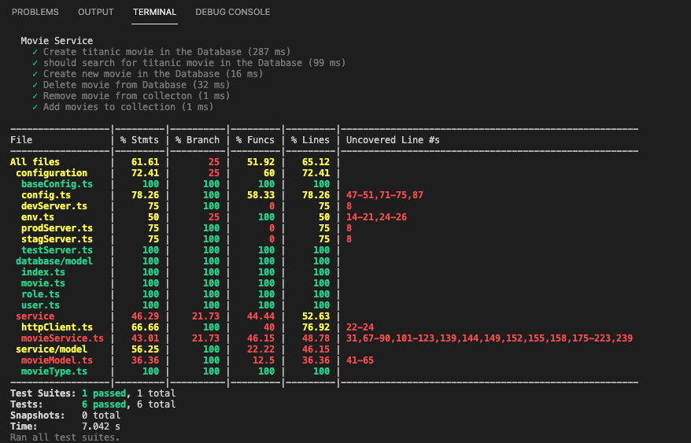

# Movies CRUD

## Introduction
    Browse or list pages of movies and add movies to your favourite list. 
    The Api gives you access to search, rank and order movies based on your choice. 
    You can as well perform crud operation on you favourite movies.

## Overview
    User needs to either create account or sign in to use all api under the movies route.

## Authentication
    Valid token is issued after registration or sing in to be used for subsequent authorisation.

## Error Codes
    403

## Rate limit
    Therd is no limit attach to the usage of the apis.

## Documentation
    https://documenter.getpostman.com/view/5921529/UzJEUKnN

## URL
    https://movies.codetechweb.xyz/

## Application Setup Stpes
    1. Clone the repository
        https://github.com/usintec/movies-crud.git

    2. Run "npm install" to install all dependencies.

    3. Setup the env (App enviroment configuration) file
        use the sample in the repo (.env.example) feel free to update
        the ENVIROMENT=TEST or DEV or STAGING or PROD as the case may be

    4. Create MySql datababse with a name to be used in the env file
    
    5. Build the app with "npm run build"

    6. Run the app with "npm run dev"

    7. Test with app with "npm run test". Note: use ENVIROMENT=TEST in the env file.

## TEST 
    I am still writing more test for more code coverage
     
    